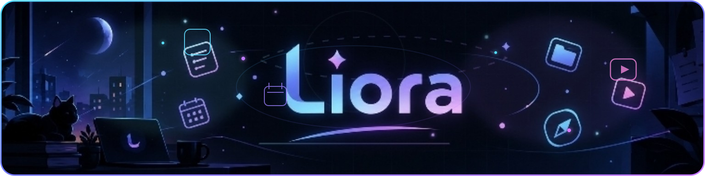
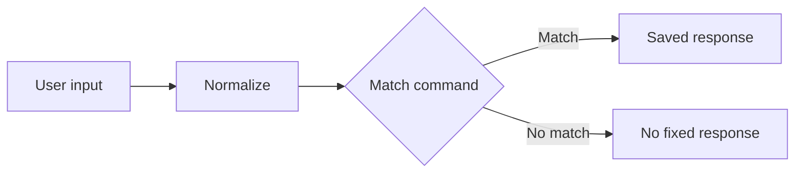

<div align="center">



### ✦ One connected personal environment

<p>
  
  
  
  
</p>

**Plan · Create · Focus · Connect · Explore**

</div>

---

## 🌌 About

Liora is a responsive personal web app that brings everyday tools into one consistent environment — from planning and notes to money, media, travel, discovery and a lightweight command assistant.

```text
PLAN → CREATE → FOCUS → MANAGE → CONNECT → WATCH → EXPLORE
```

---

## 🧭 Spaces

| Space | Purpose |
|---|---|
| 📅 **Planner** | Tasks, events, goals, habits and Focus sessions |
| 📝 **Notes** | Notes with image attachments and full-screen previews |
| ₹ **Wallet** | Saving, Current, Cash, UPI payments and requests |
| ♧ **Connect** | People, conversations and groups |
| ♫ **Media** | Songs, videos, playback and YouTube links |
| ⌁ **Travel** | Trips, dates and saved places |
| ✦ **Discover** | Interests, recommendations and saved finds |
| ◉ **Liora AI** | Fixed responses from a JSON command library |
| ⚙ **Settings** | Theme, Short Brief, notifications and app controls |

---

## 🤖 Liora AI

The assistant uses a simple command library that keeps responses transparent and easy to extend.



Commands live in **`data/liora-commands.json`**.

---

## 🧱 Tech stack

<div align="center">


<br><br>

`HTML5` · `CSS3` · `JavaScript` · `IndexedDB` · `Service Worker` · `Web App Manifest` · `JSON`

</div>

---

## 📁 Project structure

```text
liora/
├── index.html
├── manifest.webmanifest
├── liora-sw.js
├── css/
│   └── styles.css
├── js/
│   └── app.js
├── data/
│   └── liora-commands.json
├── assets/
│   ├── icons/
│   │   ├── icon-192.png
│   │   └── icon-512.png
│   └── readme/
│       └── liora-readme-banner.svg
└── README.md
```

Keeping the app split this way makes the root clean while giving each part a clear purpose.

---

## 🌱 Project

Liora is built to be extended: richer reminders, backup/import, share actions, deeper media integrations and more personal automation can be added without changing the core structure.

> **Less switching. More doing.**

---

<div align="center">

### ✦ Liora

**Made by Johan Rohith**

</div>
